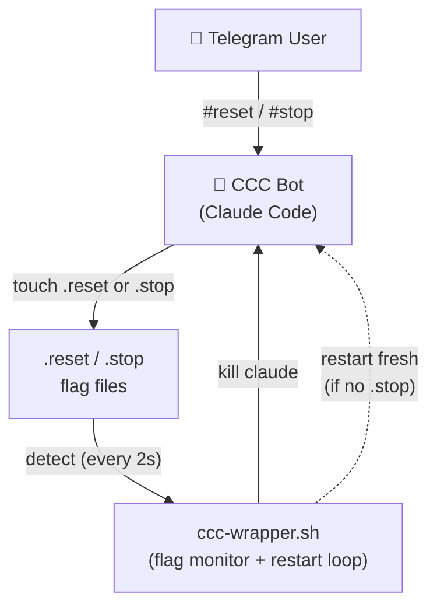

# ccc-reset-self

> Reset or stop your [Claude Code](https://docs.anthropic.com/en/docs/claude-code) Telegram session with a single message. No external monitor daemon required.

[](LICENSE)
[]()
[]()
[]()

**English** | [繁體中文](README.zh-TW.md) | [简体中文](README.zh-CN.md) | [Tiếng Việt](README.vi.md) | [ภาษาไทย](README.th.md)

---

## The Problem

Claude Code Channel (CCC) sessions running via the [Telegram plugin](https://github.com/anthropics/claude-code-plugins) have no built-in way to clear conversation context. As the context window fills up, responses degrade — and the only fix is to kill the process and start fresh.

## The Solution

**ccc-reset-self** takes a radically simple approach:

1. Teach the CCC bot to recognize `#reset` / `#stop` commands via `CLAUDE.md` instructions
2. The bot touches a flag file — that's all it does
3. A lightweight wrapper script detects the flag, kills the process, and restarts with a clean session

No Python. No polling daemon. No external monitor. Just a shell script and a markdown file.

## Architecture



**Separation of concerns:**
- **CCC bot** — recognizes commands, touches flag files. Never kills anything.
- **Wrapper** — manages all process lifecycle: monitors flags, kills Claude, restarts or exits.

## Prerequisites

- **macOS** (uses `launchd` for service management)
- **[Claude Code CLI](https://docs.anthropic.com/en/docs/claude-code)** installed
- **[Telegram plugin](https://github.com/anthropics/claude-code-plugins)** configured
- **`screen`** (`brew install screen`)

## Installation

### Quick Install (one-liner)

```bash
curl -fsSL https://raw.githubusercontent.com/robin-li/ccc-reset-self/main/get.sh | bash
```

### Install from Source

```bash
git clone https://github.com/robin-li/ccc-reset-self.git
cd ccc-reset-self
./install.sh
```

The installer:
1. Copies `ccc-wrapper.sh` to `~/.claude/scripts/`
2. Injects command instructions into `~/.claude/CLAUDE.md` (global, applies to all sessions)
3. Registers a `launchd` service for auto-start on login

## Usage

### Telegram Commands

Send these messages to your CCC bot:

| Command | Action | Behavior |
|---------|--------|----------|
| `#reset` | Reset session | Bot replies → touches `.reset` → wrapper kills & restarts |
| `reset` | Reset session | Same as above |
| `clear context` | Reset session | Same as above |
| `reset session` | Reset session | Same as above |
| `清除 context` | Reset session | Same as above |
| `重置 session` | Reset session | Same as above |
| `#stop` | Stop CCC | Bot replies → touches `.stop` → wrapper kills & exits |
| `停止ccc` | Stop CCC | Same as above |
| `停止claude` | Stop CCC | Same as above |

### Manual Control (Terminal / SSH)

```bash
# Start the wrapper manually
~/.claude/scripts/ccc-wrapper.sh ~/workspace --model sonnet

# Use a different model
~/.claude/scripts/ccc-wrapper.sh ~/workspace --model opus

# Attach to the running screen session
screen -r ccc-tg

# Trigger reset manually (flag file)
touch ~/.claude/scripts/.reset

# Trigger stop manually (flag file)
touch ~/.claude/scripts/.stop
```

### Service Management

```bash
# Check service status
launchctl list | grep ccc-wrapper

# Restart service
launchctl unload ~/Library/LaunchAgents/com.claude.ccc-wrapper.plist
launchctl load ~/Library/LaunchAgents/com.claude.ccc-wrapper.plist

# View logs
tail -f ~/.claude/logs/ccc-wrapper.log
```

## How It Works

### Reset Flow

```
1. User sends "#reset" in Telegram
2. CCC bot recognizes command (via CLAUDE.md instructions)
3. CCC bot replies "🔄 Resetting session..."
4. CCC bot runs: touch ~/.claude/scripts/.reset
5. Wrapper's flag monitor detects .reset (within 2 seconds)
6. Wrapper kills the Claude process
7. Wrapper waits 3 seconds, then starts a new Claude session
```

### Stop Flow

```
1. User sends "#stop" in Telegram
2. CCC bot recognizes command (via CLAUDE.md instructions)
3. CCC bot replies "⏹️ Stopping CCC..."
4. CCC bot runs: touch ~/.claude/scripts/.stop
5. Wrapper's flag monitor detects .stop (within 2 seconds)
6. Wrapper kills the Claude process
7. Wrapper detects .stop flag → exits (no restart)
```

## Uninstall

```bash
# From cloned repo
cd ccc-reset-self
./uninstall.sh

# Or remote one-liner
curl -fsSL https://raw.githubusercontent.com/robin-li/ccc-reset-self/main/uninstall.sh | bash
```

This removes the wrapper script, `launchd` service, and the injected section from `~/.claude/CLAUDE.md`.

## Project Structure

```
ccc-reset-self/
├── bin/
│   └── ccc-wrapper.sh          # Wrapper with built-in flag monitor
├── claude-md-snippet.md         # Instructions injected into CLAUDE.md
├── get.sh                       # Remote one-liner installer
├── install.sh                   # Local installer
├── uninstall.sh                 # Uninstaller
├── CLAUDE.md                    # Development notes
├── README.md                    # English
├── README.zh-TW.md              # 繁體中文
├── README.zh-CN.md              # 简体中文
├── README.vi.md                 # Tiếng Việt
├── README.th.md                 # ภาษาไทย
└── LICENSE
```

## FAQ

**Q: What if the CCC bot doesn't recognize the command?**
A: The instructions are placed in `~/.claude/CLAUDE.md` with high priority. Claude Code reads this file at startup. In practice, it reliably recognizes the trigger phrases. If it doesn't, you can always use the manual method: `touch ~/.claude/scripts/.reset`

**Q: Can I customize the trigger commands?**
A: Yes. Edit the `# CCC Session Control` section in `~/.claude/CLAUDE.md` to add or change trigger phrases.

**Q: Does this work on Linux?**
A: The wrapper script works on any Unix system. The `install.sh` uses macOS `launchd` for auto-start. On Linux, you'd need to set up a `systemd` service manually or adapt the installer.

**Q: How fast is the reset?**
A: The flag monitor checks every 2 seconds. Add 3 seconds for the restart delay. Total: ~5 seconds from command to fresh session.

## License

[MIT](LICENSE)
