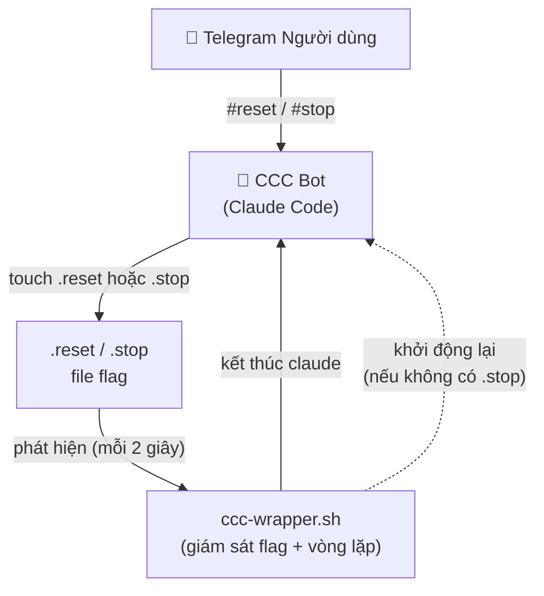

# ccc-reset-self

> Đặt lại hoặc dừng phiên [Claude Code](https://docs.anthropic.com/en/docs/claude-code) qua Telegram chỉ bằng một tin nhắn. Không cần tiến trình giám sát bên ngoài.

[](LICENSE)
[]()
[]()
[]()

[English](README.md) | [繁體中文](README.zh-TW.md) | [简体中文](README.zh-CN.md) | **Tiếng Việt** | [ภาษาไทย](README.th.md)

---

## Vấn đề

Các phiên Claude Code Channel (CCC) chạy qua [plugin Telegram](https://github.com/anthropics/claude-code-plugins) không có cách tích hợp nào để xóa ngữ cảnh hội thoại. Khi cửa sổ ngữ cảnh đầy, chất lượng phản hồi giảm — và cách duy nhất là kết thúc tiến trình và khởi động lại.

## Giải pháp

**ccc-reset-self** sử dụng cách tiếp cận tối giản:

1. Dạy CCC bot nhận diện lệnh `#reset` / `#stop` thông qua hướng dẫn trong `CLAUDE.md`
2. Bot chỉ tạo một file flag — chỉ vậy thôi
3. Script wrapper nhẹ phát hiện flag, kết thúc tiến trình và khởi động lại với phiên mới

Không cần Python. Không cần daemon polling. Không cần monitor bên ngoài. Chỉ cần một shell script và một file markdown.

## Kiến trúc



**Phân tách trách nhiệm:**
- **CCC bot** — nhận diện lệnh, tạo file flag. Không kết thúc bất kỳ tiến trình nào.
- **Wrapper** — quản lý toàn bộ vòng đời tiến trình: giám sát flag, kết thúc Claude, khởi động lại hoặc thoát.

## Yêu cầu

- **macOS** (sử dụng `launchd` để quản lý dịch vụ)
- **[Claude Code CLI](https://docs.anthropic.com/en/docs/claude-code)** đã cài đặt
- **[Plugin Telegram](https://github.com/anthropics/claude-code-plugins)** đã cấu hình
- **`screen`** (`brew install screen`)

## Cài đặt

### Cài nhanh (một dòng lệnh)

```bash
curl -fsSL https://raw.githubusercontent.com/robin-li/ccc-reset-self/main/get.sh | bash
```

### Cài từ mã nguồn

```bash
git clone https://github.com/robin-li/ccc-reset-self.git
cd ccc-reset-self
./install.sh
```

Trình cài đặt sẽ:
1. Sao chép `ccc-wrapper.sh` vào `~/.claude/scripts/`
2. Chèn hướng dẫn lệnh vào `~/.claude/CLAUDE.md` (toàn cục, áp dụng cho mọi phiên)
3. Đăng ký dịch vụ `launchd` để tự khởi động khi đăng nhập

## Sử dụng

### Lệnh Telegram

Gửi các tin nhắn sau đến CCC bot của bạn:

| Lệnh | Hành động | Hành vi |
|------|-----------|---------|
| `#reset` | Đặt lại phiên | Bot trả lời → tạo `.reset` → wrapper kết thúc & khởi động lại |
| `reset` | Đặt lại phiên | Tương tự |
| `clear context` | Đặt lại phiên | Tương tự |
| `reset session` | Đặt lại phiên | Tương tự |
| `清除 context` | Đặt lại phiên | Tương tự |
| `重置 session` | Đặt lại phiên | Tương tự |
| `#stop` | Dừng CCC | Bot trả lời → tạo `.stop` → wrapper kết thúc & thoát |
| `停止ccc` | Dừng CCC | Tương tự |
| `停止claude` | Dừng CCC | Tương tự |

### Điều khiển thủ công (Terminal / SSH)

```bash
# Khởi động wrapper thủ công
~/.claude/scripts/ccc-wrapper.sh ~/workspace --model sonnet

# Sử dụng model khác
~/.claude/scripts/ccc-wrapper.sh ~/workspace --model opus

# Kết nối vào phiên screen
screen -r ccc-tg

# Kích hoạt reset thủ công
touch ~/.claude/scripts/.reset

# Kích hoạt stop thủ công
touch ~/.claude/scripts/.stop
```

### Quản lý dịch vụ

```bash
# Kiểm tra trạng thái dịch vụ
launchctl list | grep ccc-wrapper

# Khởi động lại dịch vụ
launchctl unload ~/Library/LaunchAgents/com.claude.ccc-wrapper.plist
launchctl load ~/Library/LaunchAgents/com.claude.ccc-wrapper.plist

# Xem log
tail -f ~/.claude/logs/ccc-wrapper.log
```

## Cách hoạt động

### Quy trình Reset

```
1. Người dùng gửi "#reset" trên Telegram
2. CCC bot nhận diện lệnh (qua hướng dẫn CLAUDE.md)
3. CCC bot trả lời "🔄 Resetting session..."
4. CCC bot chạy: touch ~/.claude/scripts/.reset
5. Flag monitor của wrapper phát hiện .reset (trong vòng 2 giây)
6. Wrapper kết thúc tiến trình Claude
7. Wrapper chờ 3 giây, sau đó khởi động phiên Claude mới
```

### Quy trình Stop

```
1. Người dùng gửi "#stop" trên Telegram
2. CCC bot nhận diện lệnh (qua hướng dẫn CLAUDE.md)
3. CCC bot trả lời "⏹️ Stopping CCC..."
4. CCC bot chạy: touch ~/.claude/scripts/.stop
5. Flag monitor của wrapper phát hiện .stop (trong vòng 2 giây)
6. Wrapper kết thúc tiến trình Claude
7. Wrapper phát hiện file .stop → thoát (không khởi động lại)
```

## Gỡ cài đặt

```bash
# Từ repo đã clone
cd ccc-reset-self
./uninstall.sh

# Hoặc lệnh một dòng từ xa
curl -fsSL https://raw.githubusercontent.com/robin-li/ccc-reset-self/main/uninstall.sh | bash
```

Sẽ xóa wrapper script, dịch vụ `launchd`, và phần đã chèn trong `~/.claude/CLAUDE.md`.

## Câu hỏi thường gặp

**Q: Nếu CCC bot không nhận diện được lệnh thì sao?**
A: Hướng dẫn được đặt trong `~/.claude/CLAUDE.md` với mức ưu tiên cao. Claude Code đọc file này khi khởi động. Trong thực tế, nó nhận diện đáng tin cậy các cụm từ kích hoạt. Nếu không, bạn có thể dùng cách thủ công: `touch ~/.claude/scripts/.reset`

**Q: Có thể tùy chỉnh lệnh kích hoạt không?**
A: Có. Chỉnh sửa phần `# CCC Session Control` trong `~/.claude/CLAUDE.md` để thêm hoặc thay đổi cụm từ kích hoạt.

**Q: Có hỗ trợ Linux không?**
A: Wrapper script chạy được trên mọi hệ thống Unix. `install.sh` sử dụng macOS `launchd` để tự khởi động. Trên Linux, bạn cần tự thiết lập dịch vụ `systemd` hoặc chỉnh sửa script cài đặt.

**Q: Reset mất bao lâu?**
A: Flag monitor kiểm tra mỗi 2 giây, cộng thêm 3 giây chờ khởi động lại. Tổng cộng khoảng 5 giây từ khi gửi lệnh đến khi phiên mới sẵn sàng.

## Giấy phép

[MIT](LICENSE)
